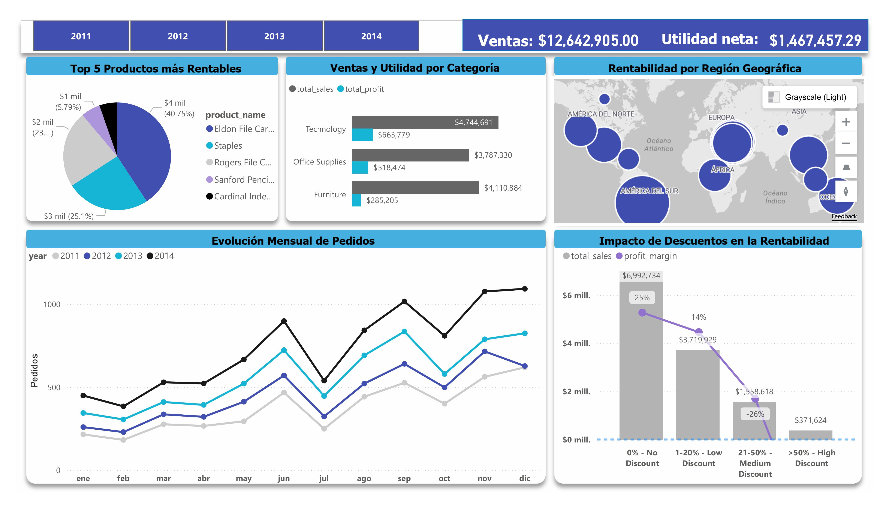

# 📊 Análisis de Ventas - Global Superstore (Power BI)

## 🔍 Descripción del Proyecto

En este proyecto se analizan las ventas, ganancias y comportamiento de los clientes utilizando el dataset de Global Superstore.
El objetivo principal es identificar qué factores afectan la rentabilidad, especialmente el impacto de los descuentos.

---

## 🎯 Objetivos

* Analizar el desempeño de ventas y ganancias
* Evaluar el impacto de los descuentos en la rentabilidad
* Identificar los productos más rentables
* Detectar patrones estacionales en los pedidos

---

## 📊 Dashboard Interactivo

👉 [Ver Dashboard](https://app.powerbi.com/view?r=eyJrIjoiOTIzZGU4ZGMtMTc0Yy00YTA5LTkyZjMtMjJkNmJiODEwY2YxIiwidCI6ImU3ZjExZWUzLTE4MzMtNDhjZi05MGQ4LWFlNWRiYTMyMDYzOCJ9)

---

## 📸 Vista previa del Dashboard

---

## 📈 Principales Insights

* Los descuentos altos (>50%) reducen significativamente la rentabilidad
* Algunos productos venden mucho pero generan poca ganancia
* Existen patrones estacionales en los pedidos
* La rentabilidad varía dependiendo de la región

---

## 🛠 Herramientas utilizadas

* Power BI
* SQL
* Python (limpieza de datos)
* Excel

---

## 📂 Dataset

Global Superstore (datos limpiados y transformados)

---

## 💡 Habilidades demostradas

* Limpieza y transformación de datos
* Modelado de datos
* Creación de medidas con DAX
* Visualización de datos
* Análisis de negocio

---

## 📌 Notas

Para el análisis se priorizaron visualizaciones que respetaran correctamente el contexto de filtros.
Algunos gráficos como el pie chart no fueron utilizados para rankings dinámicos debido a limitaciones en Power BI.
